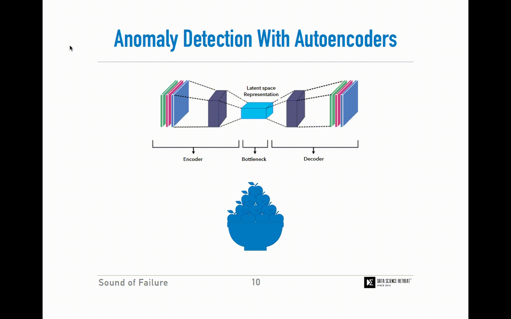
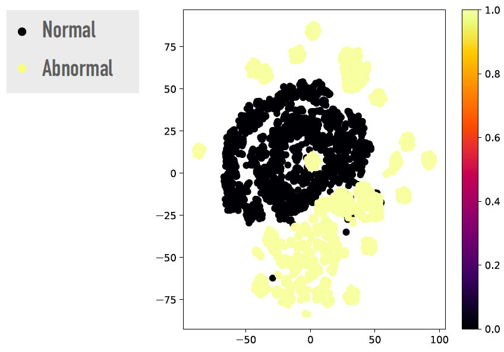
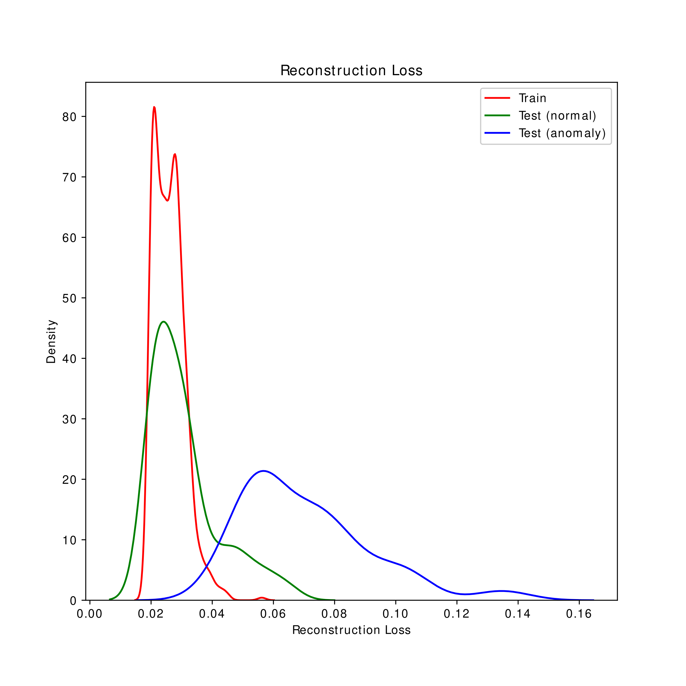
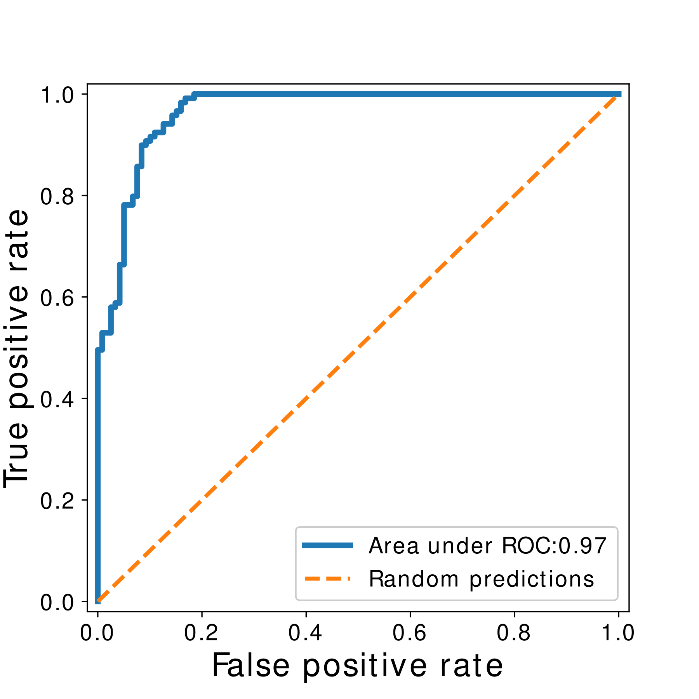

Sound of failure
==============================

An AI solution to reduce industrial downtime by diagnosing the failure of machines using their acoustic footprint.

#### -- Project Status: [Active]

### Collaborators
|Name     |  Github Page   |
|---------|-----------------|
| Wrijupan Bhattacharyya | [wrijupan](https://github.com/wrijupan)|
| Sara Ghasemi | [saraghsm](https://github.com/saraghsm) |
| Niklas Hübel | [NikoHobel](https://github.com/NikoHobel) |

## Project Description

**The problem:** Industries experience an average downtime of ~800 hours/year. The average cost of downtime can be as high as ~$20,000 per hour! Often a major cause of downtime is malfunctioning machines. Machine malfunctions often comes unplanned and in a large number of cases, the industries lack in-house expertise to detect such malfunctions before it is too late. If machine malfunctions can be detected early, downtime costs can be drastically reduced.

**The proposed solution:** The idea is to diagnose machine failures using their acoustic footprint over time. A machine will produce a different acoustic signature in its abnormal state compared to its normal state. An algorithm should be able to differentiate between the two sounds.

For a demo our our results, feel free to try yourself our [front-end prototype user interface.](https://share.streamlit.io/wrijupan/sound-of-failure/main/streamlit/app.py)

**The dataset:** In September 2019 when Hitachi, Ltd. released the [first of its kind dataset](https://zenodo.org/record/3384388#.YLCh2zYzaAw) containing ca. 100GB of wav files with normal and abnormal sounds from real-world industrial machines

### Model training

**Data preprocessing:** We convert the sound problem into a Computer Vision problem by converting machine sounds to their visual representations-Mel spectrograms. The Mel spectrograms are time-frequency heat maps for sounds which can capture well inherent acoustic patterns. 

**Deep Learning Acoustic Anomaly Detection:** We use an unsupervised Deep Learning approach to diagnose abnormal machine sounds. I.e. for training our models, we only use the sounds from normally working machines.

Our models are built on simple principles which can be visually seen here - we feed only normal machine sounds as input to an Autoencoder architecture (a Deep Neural Network with an Encoder, a Decoder and a bottleneck). The Autoencoder is trained to reconstruct back only normal sounds with a high accuracy (low reconstruction error). When during testing, an abnormal machine sound is fed as input to a trained Autoencoder for generating normal machine sounds, the reconstructed output has a bad reconstruction error. By thresholding on the reconstructing error, we can diagnose broken machine sounds as acoustic anomalies.

We used three types of Autoencoders:
* Convolution Autoencoder
* Variational Autoencoder
* LSTM Autoencoder

Variational Autoencoder is our best model in terms of its speed and accuracy.

### Results

For testing our trained models, we have built an independent test dataset (not used for training or hyper-parameter optimisation) that contains a mixture of normal and abnormal machine sounds (50:50 i.e. balanced) with the aim that our trained unsupervised model can correctly tag abnormal machine sounds, which it has never seen before, as anomalies. The test dataset is then fed to the Variational Autoencoder (VAE) trained on normal machine sounds.

The VAE works in two stages:

1. It first encodes the input sound/mel-spectrogram into a lower-dimensional latent space, also known as bottleneck (this is the Encoder part of the deep network). 

The figure below shows the latent space representation of normal and abnormal machine sounds in the test dataset. It can be clearly seen that the two sounds sit on different zones of the latent space-hence can be clearly distinguished by our algorithm.

2. It then samples a data point from the latent space and reconstructs it back to its original dimension same as the input image/mel-spectrogram. Since our VAE is trained only on normal machine sounds, the expected result is the following-low reconstruction error on normal test sounds and much higher error on the abnormal test sounds. Plotting histograms of the reconstruction errors (as can be seen on the left-hand-side figure below), clearly the model predicts much higher error on the abnormal sounds, absolutely congruent with our expectations! The predicted reconstruction errors are then used to calculate the area under the ROC curve (Right-hand-side figure below) which gives an accuracy of 97%!

|Histogram of reconstruction error on normal and abnormal machine sounds     |   Area under the ROC curve   | 
|---------|-----------------|
  |  

### Technologies

* Numpy
* Librosa
* Scipy
* Tensorflow, Keras
* Scikit-learn
* etc.

## Project Organization
------------

    ├── LICENSE
    ├── Makefile                 <- Makefile with commands like `make data` or `make train` (To be added)
    ├── README.md                <- The top-level README for description of this project and how to use it.
    ├── requirements.txt         <- The requirements file for reproducing the analysis environment
    ├── setup.py                 <- makes project pip installable (pip install -e .) so src can be imported (To be added)
    │
    ├── conf                     <- (Directory) Configuration files
    │
    │
    ├── docs                     <- (Directory) A default Sphinx project; see sphinx-doc.org for details (TBC)
    │
    ├── models                   <- (Directory) Trained and serialized models
    │
    ├── notebooks                <- (Directory) Jupyter notebooks. Naming convention is the creator's initials,
    │                               a number for ordering (typically the date), and a short `-` delimited description.
    │
    |
    └── src                      <- (Directory) Source code for use in this project.
        ├── __init__.py          <- Makes src a Python module
        │
        ├── 00_utils             <- Functions used across the project
        │
        ├── 01_data_processing   <- Scripts to turn raw data into features for modeling
        │
        ├── 02_modelling         <- Scripts to train models and then use trained models to make predictions
        │
        ├── 03_modell_evaluation <- Scripts that analyse model performance and model selection
        │
        └── 04_visualization     <- Scripts to create exploratory and results oriented visualizations
    
    

--------

<small>Project based on the <a target="_blank" href="https://drivendata.github.io/cookiecutter-data-science/">cookiecutter data science project template</a>. #cookiecutterdatascience</small>

